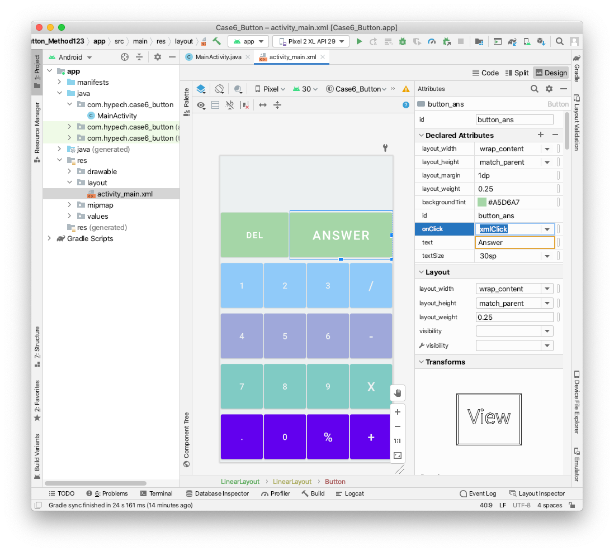

  [](https://github.com/ellerbrock/open-source-badges/)

# Case6_Button

Button is a user interface control that is used to perform an action whenever the user clicks or tap on it. Button is a simple element in most of the programming language. Android implements it in two ways: onClick attribute in XML or OnClickListener method in Java.

```java
<Button
  android:id=”@+id/button_ans”
  android:layout_width=”wrap_content”
  android:layout_height=”match_parent”
  android:layout_margin=”1dp”
  android:layout_weight=”0.25”
  android:backgroundTint=”#000080”
  android:onClick=”xmlClick”
  android:text=”Answer”
  android:textSize=”30sp” />

Then implementing xmlClick() method.
public void xmlClick(View v){
  if (v.getId() == R.id.button_ans) {
    textViewTop.setText(“ clicking ANSWER :)”);
  }else if (v.getId() == R.id.button_del) {
    textViewTop.setText(“ clicking DEL :)”);
}

button_2.setOnClickListener(this);
button_3.setOnClickListener(this);

@Override
public void onClick(View v) {
  if (v.getId() == R.id.b1) {
    textViewTop.setText(“ clicking 1 :)”);
  }else if (v.getId() == R.id.b2) {
    textViewTop.setText(“ clicking 2 :)”);
  }else {
    textViewTop.setText(“ clicking 3-9 or 0 :)”);
  }
}

button_Dot.setOnClickListener(new View.OnClickListener() {
  @Override
  public void onClick(View v) {
    textViewTop.setText(“ Anonymous onClick Dot :)”);
  }
});

```

Introduction
------------

Just put in mind: we can receive callbacks when a button or other view is tapped through OnClickListener which has a method named onClick. All the ways implementing button click is around this core concept.

Remember we said “everything is view”? Button is a view. And everything we done for a button could apply for view family (like textview, imageview, layout, etc.)

Pre-requisites
--------------

- Android Studio 
- SDK 23

Screenshots
-------------

 

Getting Started
---------------

* Android Studio: Download this case from github and open it directly in Android Studio.
* Other IDE: This case uses the Gradle build system. To build this project, use the "gradlew build" command or use "Import Project".

Support
-------

1. GitHub: https://github.com/hypech/
2. Stack Overflow: https://stackoverflow.com/story/hypech
3. Twitter: https://twitter.com/hypechor
4. Youtube: https://www.youtube.com/channel/UCtkxCO5vVSvWMN-HMs0JZyg
5. Tiktok: https://www.tiktok.com/@androidcase
6. http://hypech.github.io
7. http://hypech.com
8. info@hypech.com

If you've found an error in this case, please file an issue on top left of this screen besides <>code.

Patches are encouraged, and may be submitted by forking this project and submitting a pull request through GitHub. 


 <pre>
  Copyright 2021 The Learning Android with Cases Open Source Project

  Licensed under the Apache License, Version 2.0 (the "License");
  you may not use this file except in compliance with the License.
  You may obtain a copy of the License at

      http://www.apache.org/licenses/LICENSE-2.0

  Unless required by applicable law or agreed to in writing, software
  distributed under the License is distributed on an "AS IS" BASIS,
  WITHOUT WARRANTIES OR CONDITIONS OF ANY KIND, either express or implied.
  See the License for the specific language governing permissions and
  limitations under the License.
  
</pre>
